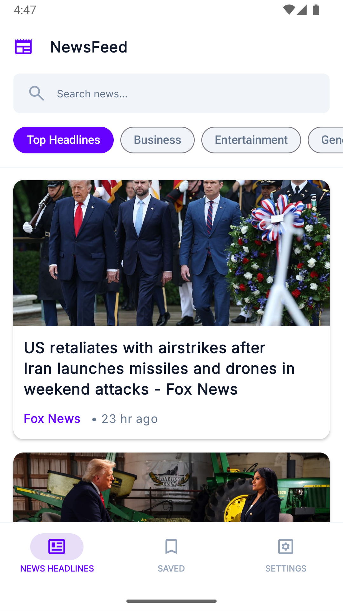
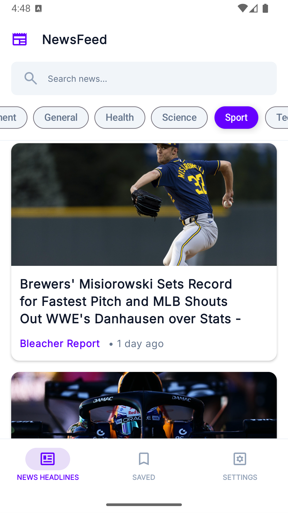
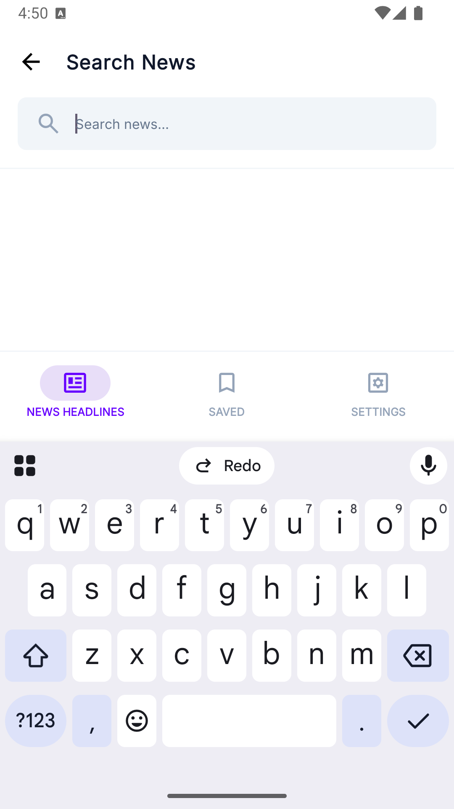
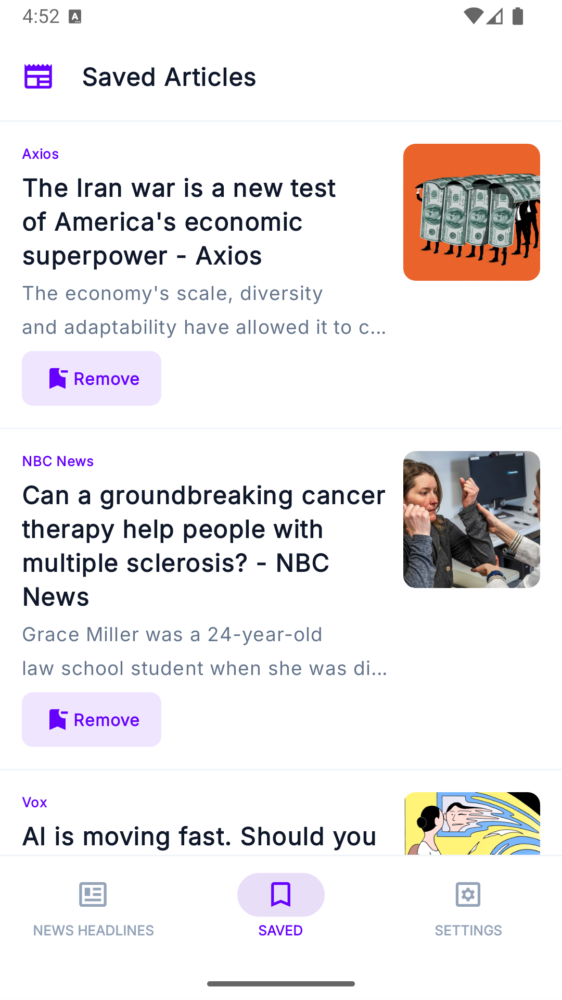
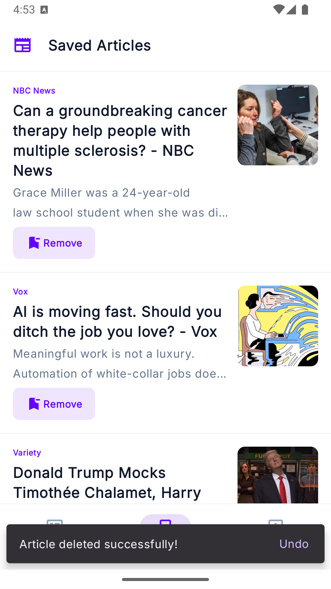
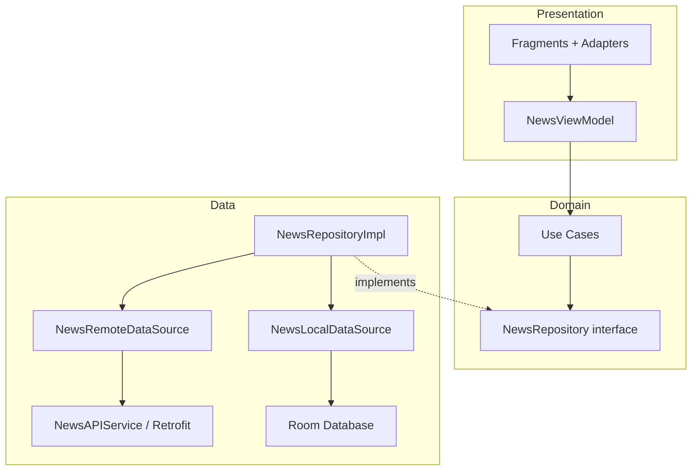

# NewsApiClient

A native Android news reader that fetches live headlines from [NewsAPI](https://newsapi.org), lets you browse by category, search articles, read full stories in-app, and save favorites for offline access.

Built with Clean Architecture, MVVM, and modern Android libraries as a portfolio project demonstrating production-style patterns.

---

## Screenshots

> Add your screenshots to `docs/screenshots/` and replace the placeholders below.

| Home — Top Headlines |                    Category Filter                     | Search |
|:---:|:------------------------------------------------------:|:---:|
|  |  |  |

| Article Detail | Saved Articles | Delete with Undo |
|:---:|:---:|:---:|
|  |  |  |

---

## Features

- **Top headlines feed** — Browse US news with a scrollable list showing title, source, image, and relative publish time
- **Category filtering** — Filter by Business, Entertainment, General, Health, Science, Sport, or Technology via Material chips
- **Search** — Full-text search across headlines with a dedicated search screen
- **Article detail** — Read articles in an embedded WebView with toolbar actions
- **Bookmark articles** — Save articles to local storage via FAB or overflow menu
- **Saved articles** — View and manage bookmarked articles in a dedicated tab
- **Delete with undo** — Remove saved articles with a Snackbar undo action
- **Share** — Share article title and URL via the system share sheet
- **Connectivity check** — Graceful error handling when the device is offline

---

## Architecture

The app follows **Clean Architecture** with three layers and unidirectional data flow:



| Layer | Responsibility |
|-------|----------------|
| **Presentation** | UI (Fragments, ViewBinding), `NewsViewModel`, Hilt modules, RecyclerView adapters |
| **Domain** | Use cases and repository contracts — no Android or framework dependencies |
| **Data** | Retrofit API client, Room persistence, repository implementation, `Resource` wrapper |

**Patterns used:** MVVM · Repository · Use Case · Dependency Injection (Hilt) · Single Activity + Navigation Component

---

## Tech Stack

| Category | Libraries |
|----------|-----------|
| Language | Kotlin |
| UI | View Binding, Data Binding, Material Design 3, Edge-to-Edge |
| Architecture | AndroidX Lifecycle (ViewModel, LiveData), Coroutines |
| Networking | Retrofit, OkHttp, Gson |
| Local storage | Room |
| DI | Dagger Hilt (KSP) |
| Navigation | Navigation Component + Safe Args |
| Images | Glide |
| Testing | JUnit, Robolectric, MockWebServer, Google Truth |

**Requirements:** Android 9+ (API 28) · compileSdk 36

---

## Project Structure

```
app/src/main/java/com/example/newsapiclient/
├── data/
│   ├── api/              # Retrofit service
│   ├── db/               # Room database, DAO, type converters
│   ├── model/            # Article, APIResponse, Source
│   ├── repository/       # Repository impl + data sources
│   └── util/             # Resource wrapper (Loading / Success / Error)
├── domain/
│   ├── repository/       # Repository interface
│   └── usecase/          # GetNewsHeadlines, Search, Save, Delete, etc.
├── presentation/
│   ├── adapter/          # News, Search, Saved adapters (DiffUtil)
│   ├── di/               # Hilt modules (Net, DB, Repository, UseCase, …)
│   ├── util/             # timeAgo, category helpers
│   └── viewmodel/        # NewsViewModel + Factory
├── MainActivity.kt
├── NewsFragment.kt
├── SearchNewsFragment.kt
├── NewsDetailFragment.kt
├── SavedNewsFragment.kt
└── SettingsFragment.kt
```

---

## Getting Started

### Prerequisites

- Android Studio (Ladybug or newer recommended)
- JDK 17+
- A free API key from [newsapi.org](https://newsapi.org/register)

### Setup

1. **Clone the repository**

   ```bash
   git clone git@github.com:israe1/NewsApiClient.git
   cd NewsApiClient
   ```

2. **Configure API credentials**

   Create or edit `gradle.properties` in the project root (this file is gitignored):

   ```properties
   API_KEY=your_newsapi_key_here
   BASE_URL=https://newsapi.org/v2/
   ```

3. **Build and run**

   ```bash
   ./gradlew assembleDebug
   ```

   Or open the project in Android Studio and run on an emulator or physical device.

---

## Testing

Unit tests cover the Retrofit API layer using a mock server and fixture JSON:

```bash
./gradlew test
```

Tests live in `app/src/test/` and use Robolectric, MockWebServer, and Truth for assertions.

---

## API Reference

This app consumes the [NewsAPI Top Headlines](https://newsapi.org/docs/endpoints/top-headlines) endpoint:

| Endpoint | Usage |
|----------|-------|
| `GET /v2/top-headlines` | Fetch headlines by country and optional category |
| `GET /v2/top-headlines?q=` | Search headlines by keyword |

---

## Roadmap

- [ ] Settings screen (country selection, theme toggle)
- [ ] Pagination / infinite scroll
- [ ] Pull-to-refresh
- [ ] Dark theme polish

---

## License

This project was built as a learning and portfolio piece. Feel free to explore the code and use it as a reference.
